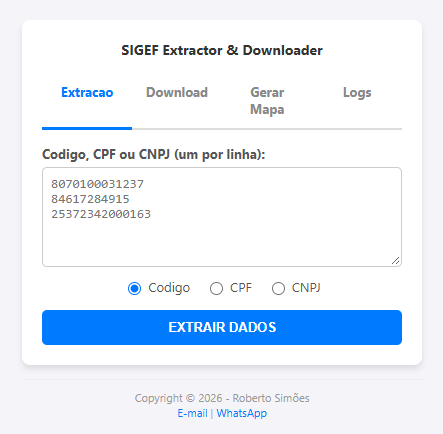
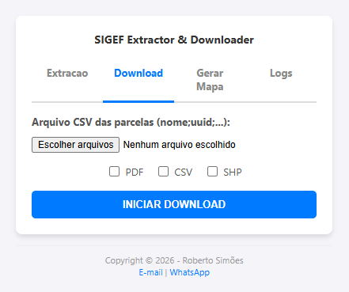
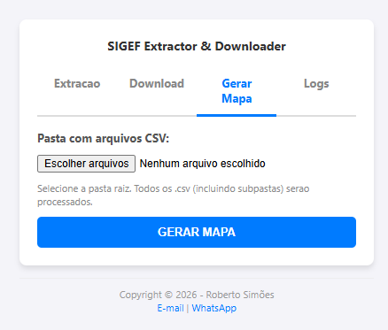
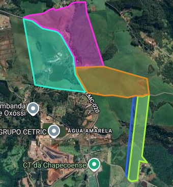
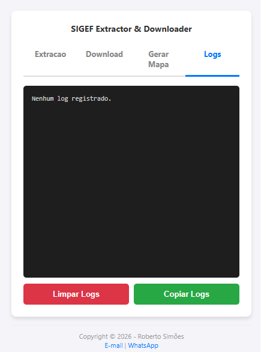
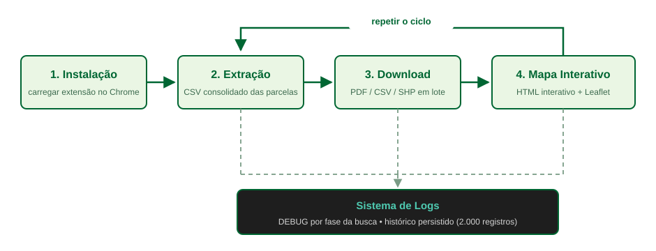
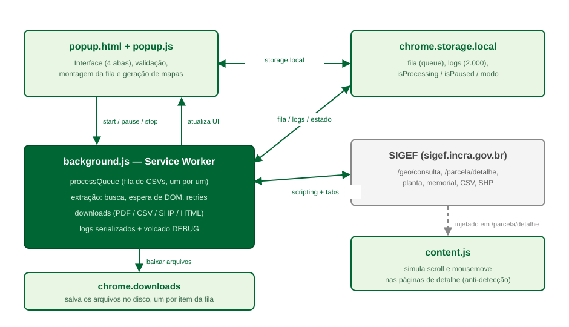

# SIGEF Extractor & Downloader

Extensão para Google Chrome (**Manifest V3**) que automatiza a extração de dados cadastrais e downloads em lote de documentos georreferenciados do **SIGEF (INCRA)**.

---

## Visão Geral

| Item | Detalhe |
|------|---------|
| Nome | SIGEF Extractor & Downloader |
| Versão | 2.2 |
| Plataforma | Google Chrome / Microsoft Edge |
| Arquitetura | Manifest V3 (Service Worker) |
| Autor | Roberto Simões |

---

## Funcionalidades

### 1. Extração de Dados (Scraper)

Extrair dados cadastrais de parcelas do SIGEF a partir de códigos de imóvel, CPF ou CNPJ.



**Como funciona:**
1. O usuário digita códigos/CPF/CNPJ na caixa de texto (um por linha)
2. Seleciona o tipo de dado (Código, CPF ou CNPJ)
3. Clica em "EXTRAIR DADOS"
4. A extensão abre uma aba e, para cada item:
   - digita o valor no campo (`id_sncr` ou `id_cpf_cnpj`) de forma humana
   - **aguarda os atributos `name` e `value` do input ficarem corretos** (o valor muda enquanto digita)
   - espera um **delay aleatório de 3 a 5 segundos** e então clica em **Pesquisar**
     (com *fallback* para `form.requestSubmit()` caso a cadeia de mouse não dispare o envio)
   - aguarda o **DOM completo** (`readyState = complete`) antes de verificar os resultados
   - só então decide: paginação ou próximo item da fila
5. Gera um arquivo CSV consolidado com todos os dados encontrados

**Robustez e diagnóstico:**
- Retries de busca (3 tentativas) com recarga da página
- Verificação de `Resultados: 0` apenas com a página totalmente carregada
- Busca com **`Resultados: 0` → nenhum CSV é baixado** para esse código (só baixa com resultados > 0)
- Log de depuração detalhado (`DEBUG[...]`) na aba **Logs**, com cada fase da busca
  (digitação, value, name, espera, clique, reação da página)

**Dados extraídos por parcela:**
- Nome da parcela
- Código (UUID)
- Área
- Detentor
- CNS (Chave Nacional de Sigilo)
- Matrícula

---

### 2. Download em Lote de Documentos

Baixar documentos oficiais do SIGEF (PDF, CSV, Shapefile) em lote, organizados por pasta.



**Tipos de arquivo disponíveis:**

| Tipo | Conteúdo | Formato |
|------|----------|---------|
| PDF | Planta do imóvel + Memorial Descritivo | `.pdf` |
| CSV | Exportação de dados da parcela | `.csv` |
| SHP | Shapefile completo | `.zip` |

**Como funciona:**
1. Seleciona **um ou mais arquivos CSV** das parcelas (botão permite múltipla seleção)
2. Marca os tipos de arquivo desejados (PDF, CSV, SHP)
3. Clica em "INICIAR DOWNLOAD"
4. Todos os CSVs são adicionados **em fila** e baixados **um a um**, cada um em **sua própria pasta**
   (o nome da pasta é o nome do arquivo CSV, sem a extensão)

**Estrutura de pastas gerada:**
```
Downloads/
├── 7010920297421/            ← pasta do arquivo 7010920297421.csv
│   └── Nome_Parcela/
│         ├── Nome_Parcela_UUID_planta.pdf
│         ├── Nome_Parcela_UUID_memorial.pdf
│         ├── Nome_Parcela_UUID.csv
│         └── Nome_Parcela_UUID.zip
├── 7010920297425/            ← pasta do arquivo 7010920297425.csv
│   └── Nome_Parcela/
│         └── ...
└── ...
```

---

### 3. Geração de Mapa Interativo

Criar um mapa HTML interativo a partir de arquivos CSV com polígonos WKT.



**Como funciona:**
1. Seleciona a pasta raiz contendo os arquivos CSV
2. A extensão processa recursivamente todos os `.csv`
3. Detecta automaticamente colunas WKT/GEOMETRIA/GEOMETRY
4. Gera um mapa HTML com:
   - Polígonos coloridos por imóvel
   - Camadas Google Maps (Híbrido, Satélite, Terreno)
   - Legenda com nome, link SIGEF e área em hectares
   - Área total calculada automaticamente



---

### 4. Sistema de Logs

Registro completo de todas as operações realizadas.



**Recursos:**
- Logs coloridos por nível (informação, sucesso, aviso, erro)
- Timestamp em cada entrada
- Escrita **serializada** (nenhuma mensagem se perde mesmo com várias entradas simultâneas)
- Limite de 2000 registros (os mais antigos são removidos)
- Linhas `DEBUG[...]` com o passo a passo da busca na página do SIGEF
- Função para limpar e copiar logs

---

## Ciclo do Software



### Etapa 1 — Instalação
1. Baixar/clonar o repositório
2. Abrir `chrome://extensions/`
3. Ativar "Modo do desenvolvedor"
4. Clicar em "Carregar sem compactação"
5. Selecionar a pasta do projeto

### Etapa 2 — Extração
1. Abrir o popup da extensão
2. Digitar dados de busca (código/CPF/CNPJ)
3. Iniciar extração
4. Sistema busca, pagina e gera CSV consolidado

### Etapa 3 — Download
1. Selecionar um ou mais CSVs gerados na etapa anterior
2. Selecionar tipos de arquivo (PDF/CSV/SHP)
3. Iniciar download
4. Os itens entram em fila e são baixados um a um, cada CSV na sua pasta

### Etapa 4 — Mapa
1. Selecionar pasta com CSVs de polígonos
2. Gerar mapa HTML interativo
3. Abrir resultado no navegador

---

## Pré-requisitos

- Google Chrome 88+ ou Microsoft Edge 88+
- Conta ativa no SIGEF (INCRA)
- Login manter durante toda a execução

---

## Permissões da Extensão

| Permissão | Finalidade |
|-----------|------------|
| `downloads` | Salvar arquivos e relatórios |
| `tabs` | Criar, fechar e navegar abas |
| `scripting` | Injetar scripts de automação |
| `activeTab` | Verificar status de login |
| `storage` | Persistir fila e estado |
| `webNavigation` | Rastrear carregamento de páginas |

---

## Arquitetura Técnica

### Estrutura de Arquivos

```
Downloader/
├── manifest.json          # Configuração (permissões, metadados, ícones)
├── popup.html             # Interface do usuário (4 abas)
├── popup.js               # Lógica do popup e geração de mapas
├── background.js          # Service Worker (motor de automação)
├── content.js             # Script de simulação comportamental
├── icons/                 # Ícones da extensão
│   ├── icon16.png         # Ícone 16x16
│   ├── icon32.png         # Ícone 32x32
│   ├── icon48.png         # Ícone 48x48
│   └── icon128.png        # Ícone 128x128
├── assets/                # Imagens deste README (telas, diagramas)
├── README.md              # Esta documentação
├── DOCUMENTACAO_TECNICA.md # Documentação técnica detalhada
└── LICENSE                # Licença
```

### Componentes



| Componente | Responsabilidade |
|------------|-----------------|
| **popup.html/js** | Interface do usuário, validação, estado visual |
| **background.js** | Motor principal: fila, automação, downloads |
| **content.js** | Anti-detecção: scroll e mouse simulados |
| **chrome.storage** | Persistência: fila, logs, configurações |

---

## Tecnologias Utilizadas

| Tecnologia | Uso |
|------------|-----|
| JavaScript ES2020+ | Linguagem principal |
| Chrome Extensions API v3 | Plataforma |
| HTML/CSS | Interface do usuário |
| Leaflet.js | Mapas interativos |
| API Google Maps | Camadas de mapas |

---

## Boas Práticas Implementadas

- **Anti-detecção**: Digitação pausada, movimentos de mouse, delays aleatórios (3–5s antes do clique)
- **Confiabilidade**: Aguarda `name`/`value` do input e DOM completo antes de agir
- **Diagnóstico**: Log DEBUG por fase + gravação serializada (sem mensagens perdidas)
- **Tratamento de erros**: Retry com 3 tentativas, recuperação de abas
- **Persistência**: Estado sobrevive ao fechamento do popup
- **Segurança**: Permissões mínimas necessárias
- **Organização**: Estrutura de pastas automática (um CSV = uma pasta)

---

## Suporte

Desenvolvido por **Roberto Simões**

| Canal | Contato |
|-------|---------|
| E-mail | robsimoes@gmail.com |
| WhatsApp | +55 (48) 99679-3828 |
| LinkedIn | linkedin.com/in/robertosim |

---

## Documentação Adicional

- [DOCUMENTACAO_TECNICA.md](DOCUMENTACAO_TECNICA.md) — Documentação técnica completa com fluxogramas, APIs, e detalhes de implementação

---

*SIGEF Extractor & Downloader v2.1 — Copyright © 2026 Roberto Simões*